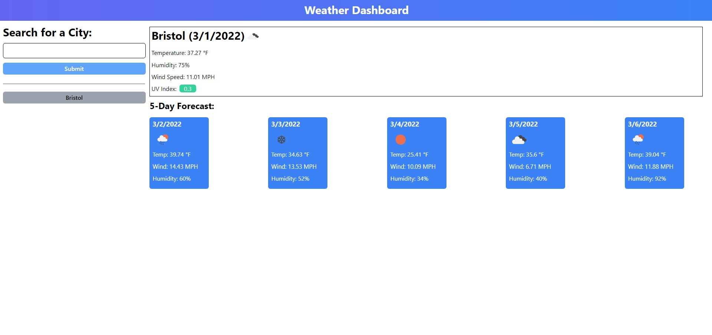

# Weather Dashboard Challenge

## Description

My motivation with this project was to learn how to properly use server side APIs, get a better understanding of TailwindCSS, and utilize jQuery. I had a lot of issues with appending/prepending the DOM properly because from what I've gathered, DOM will not paint until alerts are clicked. I solved my problem with a setTimeout function around the alert.

I learned a lot about server side APIs, how to properly access their data, and put it out into the HTML. I also learned how to use TailwindCSS, pretty similar to Bootstrap, and I furthered my knowledge of jQuery.

## Usage

Live link: [Weather Dashboard Challenge](https://norklas.github.io/birman-fluff/)

To use this site, simply type in a city, hit submit, and upon submission, you should have a display of the current weather, and the five day forecast. If you want to search again, you can, and it'll be added in the search history as a clickable button, which will generate that city's weather data again.

## Credits

I've used [tailwind css](https://tailwindcss.com/), [Moment.js](https://momentjs.com/), [Openweathermap API](https://openweathermap.org/api) and [jQuery](https://api.jquery.com/) for this project.

The [tailwindcss documentation](https://tailwindcss.com/docs/installation) was incredibly helpful in this process. I also relied heavily on [One Call API](https://openweathermap.org/api/one-call-api), [Current Weather API](https://openweathermap.org/current), [jQuery documentation](https://api.jquery.com/), and [Moment.js documentation](https://momentjs.com/docs/).
